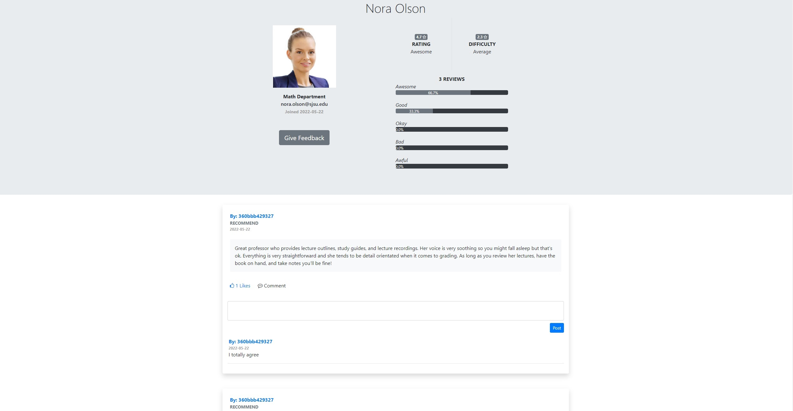

# Professor Reviews
Professor Reviews is about helping students in answering a single question: "What do I need to know in order to enhance my chances of success in a certain class?"

* Allow SJSU students to provide indirect feedback and assign ratings to their professors.
* Give future students insight into what their future classes may look like.
* Professors can also use this tool to gauge the experience students are having in their class.
* Using SHA2 one-way encryption allows students to stay anonymous.

## Getting Started
The website requires Python version 3.9 or above.

Getting Started
* Required dependencies include: Flask 2.x, SQLAlchemy, Flask-Login, WTForms
* Run run.py inside myapp folder using python run.py command

